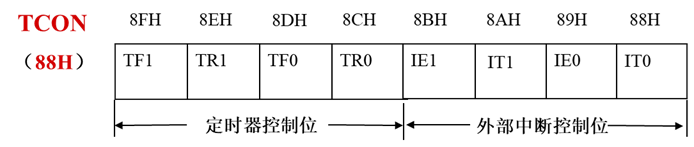
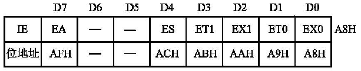
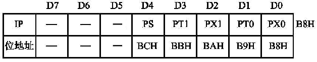
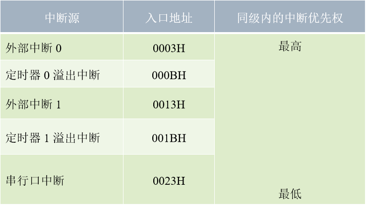
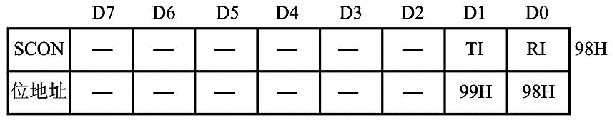

# 中断系统
有四个控制寄存器，五个中断源(2个外部、3个内部)
## 中断控制的四个寄存器：TCON、IE、SCON、IP  

- 中断请求标志寄存器`TCON(Timer Control Register)`(中断请求标志寄存器)
- 中断允许寄存器`IE(Interrupt Enable)`(中断允许寄存器)
- 串行口控制寄存器`SCON(Serial Port Control)`(串行口控制寄存器)
- 中断优先级寄存器`IP(Interrupt Priority)`(中断优先级寄存器)
---


## TCON


既可以对八位整体操作，也能单个字节操作

TF(Timer Overflow Flag)(溢出)
```
TF0(或TF1)：定时器T1(或T0)的溢出标志位
计满数时产生溢出，既TF1=1
中断允许时，发出定时器T1(或T0)的中断请求，进入中断服务程序后，由硬件自动清0
```
---
TR(Timer Run Control)(启停)
```
TR0(或TR1)：定时器T1(或T0)的启动控制位
置0时，停止工作	
置1时，启动定时器T1(或T0)
TR0(或TR1)由软件置1或清0
```
---
IE(External Interrupt Request Flag)(溢出)
```
IE0(或IE1)：外部中断0(或1)的请求标志位
置0时，没有中断请求	
置1时，有中断请求，响应中断请求，完成后由硬件自动清0
硬件自动清0
```
---
IT(Interrupt Trigger for External Interrupt)(触发方式控制)
```
IT0(或IT1)：触发方式控制位
置0时，电平触发方式(低电平有效)
置1时，边沿触发(下降沿触发)
```


## IE


既可以对八位整体操作，也能单个字节操作

```
EA(Enable all)：中断允许总控制位
置0时，屏蔽所有中断请求
置1时，开总中断，但每个中断源的中断请求位，要各自允许控制
```
---

```
ES(Serial port Interrupt Enable)：串行口中断允许位
置0时，禁止串行口的中断
置1时，允许
```

---
	
```
ET1(ET0)(Timer Interrupt Enable)：定时器T1(ET0)的中断允许位
置0时，禁止定时器T1(ET0)的中断请求
置1时，允许
```

---

```
EX1(EX0)(External Interrupt Enable)：外部中断1(EX0)允许位
置0时，禁止外部中断1(EX0)的中断请求
置1时，允许
```
---

## IP



既可以对八位整体操作，也能单个字节操作

```
PS(PS)：串行口优先级 设定位
置0时，
置1时，设置串行口`高`优先级
```
---
```
PT1(PT0)：定时器T1(T0)优先级 设定位
置0时，
置1时，设置T1(T0)`高`优先级
```
---
```
PX1(PX0)：外部中断1(或0)优先级 设定位
置0时，
置1时，设置外部中断1(或0)`高`优先级
```
**外部中断0→定时器 0中断→外部中断1→定时器1中断→串行口中断**
---

## SCON


既可以对八位整体操作，也能单个字节操作

```
RI：串行口`接受`中断 请求 标志位
接受`一帧`数据后 会被置1，请求中断，**需要`软件置0`**
```
---
```
TI：串行口`发送`中断标志位
发送完`一帧`数据后 会被置1，请求中断，**需要`软件置0`**
```
