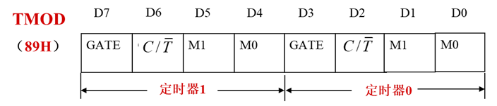

# 定时器/计数器
由  工作模式寄存器`TMOD(Timer Mode Register)`

和  控制寄存器`TCON(Timer Control Register)`

构成
## TMOD


只能对八位整体操作，不能单个字节操作

```
GATE：门控位
置0时，只要TCON中的TR0(或TR1)为1，才启动启动定时器(或计数器)
置1时，只有引脚INT0(或INT1)为高电平，才启动定时器(或计数器)
```
---
```
C/T：功能选择位
置0时，为定时器功能，计数器采样的是内部时钟脉冲，每一个机器周期加1。
置1时，为计数器功能，计数器采样的是外部引脚信号，即T0(P3.4)或T1(P3.5)端的外部脉冲。
```
---


- **方式0：**
    - 计数器：2^13 = 1 - 8192(计数范围)
    - 定时器：
        最大值8192*机器周期

            定时时间 = 计数次数*机器周期
                     = （2^13 - 计数初值）×机器周期

- **方式1：** 由TL0作为低8位、TH0作为高8位，组成16位
    - 计数器：2^16 = 1 - 65536(计数范围)
    - 定时器：
        最大值65536*机器周期

            定时时间 = 计数次数*机器周期
                     = （2^16 - 计数初值）×机器周期

- **方式2：** TL0为8位计数器，TH0为计数器初值暂存器
    - 计数器：2^8 = 1 - 256(计数范围)
    - 定时器：
         最大值256*机器周期

            定时时间 = 计数次数*机器周期

                     = （2^8 - 计数初值）×机器周期

- **方式3： 工作方式3只适用于定时/计数器T0**

     TL0可以构成8位的定时器或计数器，而TH0则只能作为定时器来用。(即TH0 不能对外部脉冲进行计数) 。

    - 计数器(C/T=1)：2^16 = 1 - 65536(计数范围)
    - 定时器(C/T=0)：
        最大值65536*机器周期

            定时时间 = 计数次数*机器周期

                     = （2^16 - 计数初值）×机器周期

**例子：** (不能进行位控制)
```
[√] TMOD = 0x11;既是 配置 `定时器T0` 和 `定时器T1` 为 `模式1` 是正确格式

[x] M0 = 1;既是配置 模式1；C/T=0 → 定时器模式；GATE=0 → 软件控制 是错误格式
```


## TCON


既可以对八位整体操作，也能单个字节操作

```
TF0(或TF1)：定时器T1(或T0)的溢出标志位
计满数时产生溢出，既TF1=1
中断允许时，发出定时器T1(或T0)的中断请求，进入中断服务程序后，由硬件自动清0
```
---
```
TR0(或TR1)：定时器T1(或T0)的启动控制位
置0时，停止工作
置1时，启动定时器T1(或T0)
TR0(或TR1)由软件置1或清0
```